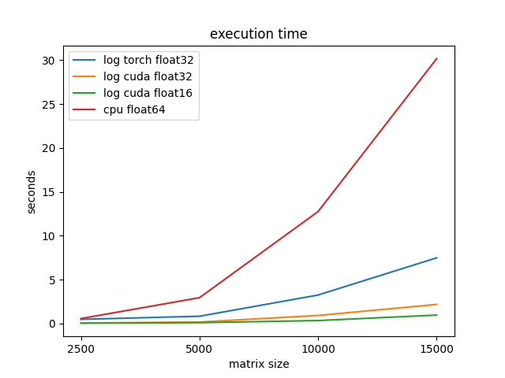

# cuGAL
A fast CUDA version of the FUGAL graph alignment algorithm.

## Install
1. Run `pip -r requirements.txt` to install dependencies.
2. To use the CUDA implementation, run `python setup.py install` or `pip install .` in `cuda_kernels/`.
3. Run `pip install .`.

## Running tests
Run `python -m unittest` inside `test/`.

## Running bencmarks
Run `python *.py` in `benchmark/`.

